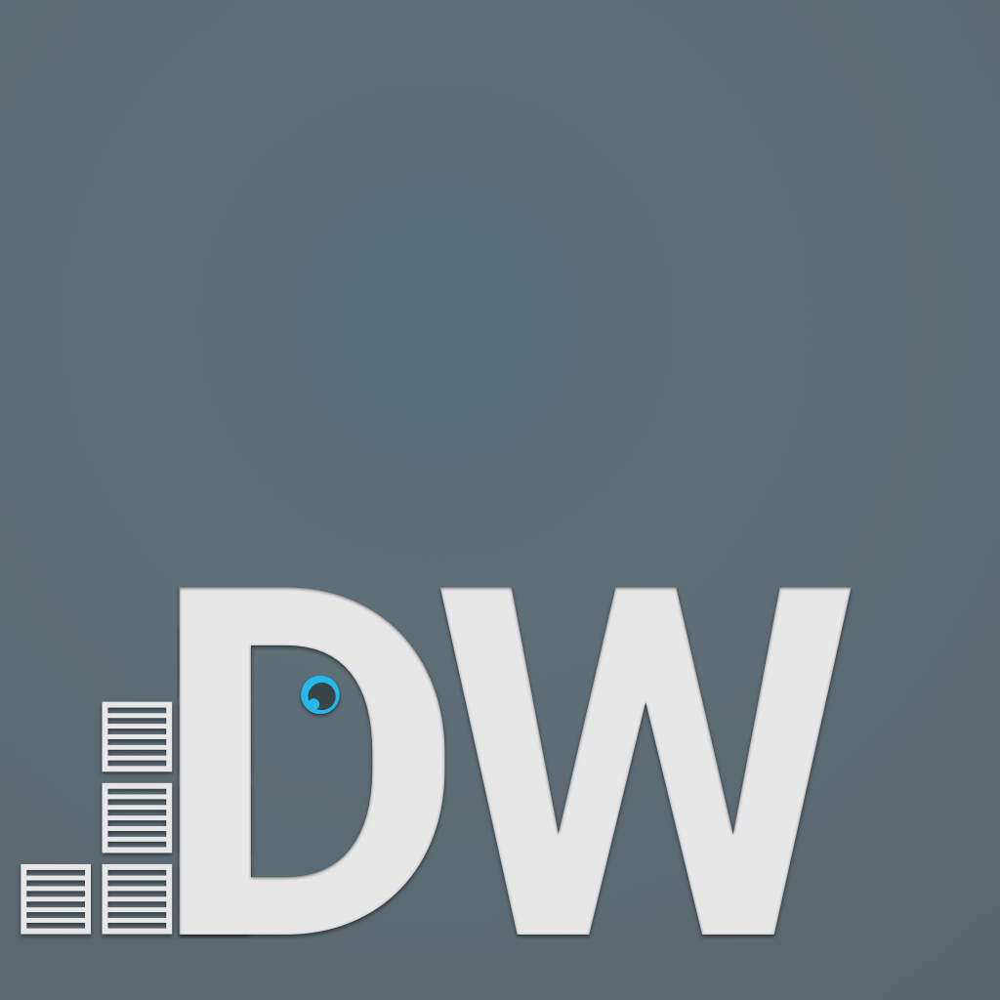

#DWatch
[](https://travis-ci.org/Mercateo/dwatch)
[](https://ci.appveyor.com/project/otbe/dwatch/branch/master)
[](https://coveralls.io/github/Mercateo/dwatch?branch=master)

This is a very basic productivity tool for managing your docker containers, images and networks. It supports your local docker
installation just as your swarm cluster. Its available for OS X (as .dmg), Linux (as .deb) and Windows (as .exe). If you're interested, please have a look
at the release page.

If you find bugs please file an issue.

##Motivation
Im a big fan of docker and how it simplifies my daily work. No more ```npm i``` for 50+ projects, you know what I mean :)
But basically *DWatch* is a big technology evaluation for our upcoming SPAs. We tried several architectures
and _hot_ frameworks in separate small applications for battle testing different concepts against our needs.
*DWatch* is an almost production-ready app and we proudly present it to you :)
There are many things missing and many things can be done better in future.

##Core technologies
* [TypeScript](http://www.typescriptlang.org)
* [React](https://facebook.github.io/react/)
* [mobx](https://github.com/mobxjs/mobx)
* [inversify](http://inversify.io)

And for build, testing and distributing: webpack, babel, karma, electron, electron-builder and many more :)

Thanks to all participating devs for such great tools :)

##Roadmap and missing features
* images
* networks
* volumes
* cluster view (nodes)
* test coverage
* overall refactoring

Some long-term features that I want to add (no order):

* filter/search for containers, images, networks
* terminal support for container
* filesystem changes for container
* querying registry (private and docker hub)
* better networking support

##Local development
* install deps: ```npm i```
* start a watch task: ```npm run watch```
* start electron: ```npm run start```

After these steps *DWatch* appears on your desktop and code changes inside ```src/``` are reflected instantly.

##Special thanks goes to
* @donaldpipowitch for many inspiring discussions about ... everything :)
* @mweststrate for enlightening conversations on gitter and github about how mobx works
* @remojansen for uncomplicated and great support about inversify
* and to all people at [docker](https://www.docker.com) for creating such an amazing environment
